# PM Loop

PM Loop 是一套面向个人 PM 工作流的本地控制面。它把来源采集、需求判断、概念学习、竞品跟踪、运行调度、OpenViking 语义队列、人工审批、产物登记和历史留存，收敛为一条可回放、可审计、可恢复的运行链路。

它解决的不是“再做一个聊天窗口”，而是把一次 PM 工作变成一组可判断的步骤：固定事实快照，说明结论来自哪里，区分草稿和真实写入，并在需要人工决定时停在 Gate。

 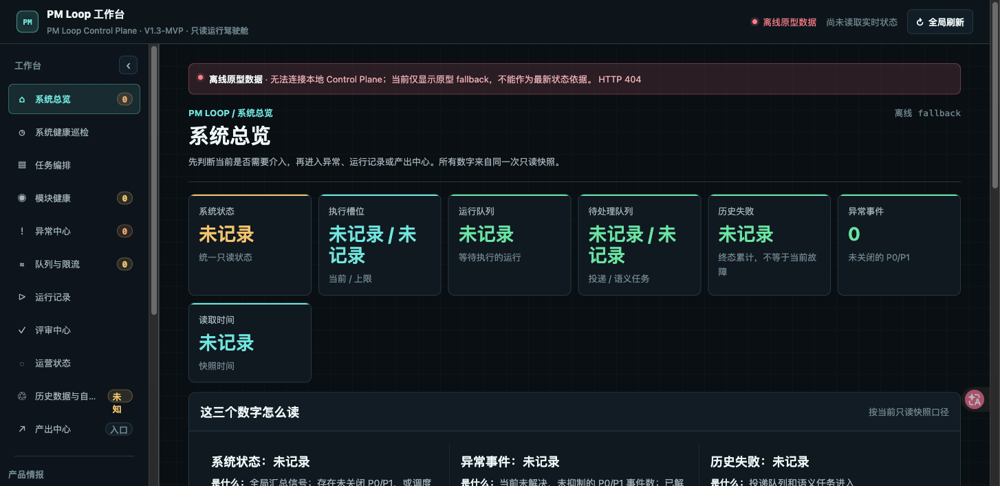 

## 能做什么

### 1. 本地工作台与 Control Plane

工作台是所有能力的只读入口，默认读取本机 Control Plane 的状态和产物：

- **总览**：查看当前数据源是否新鲜、最近运行、队列积压、健康问题和待处理事项。
- **运行台账**：按 Run 查看取证、分析、校验、输出和 Gate 的阶段进度；每个阶段都能回放事件和输入快照。
- **待审批**：集中展示 `awaiting_human` 的动作，只允许人工确认、退回或暂停，不在浏览器里直接执行。
- **数据源**：查看 `pm-timeline`、OpenViking、Skills、Ontology 等来源的状态、更新时间和证据摘要。
- **诊断**：展示失败原因、错误指纹、依赖阻断和 Codex 只读诊断建议，避免把“没有证据”误报成“业务失败”。
- **调度配置**：展示日历任务、依赖任务、锁、截止时间、最近运行和下次运行；基础设施任务与 PM 任务分开呈现。
- **竞品雷达**：进入最新采集、证据覆盖和 reviewer 结论。
- **Retention**：查看数据源登记、策略分类、预计到期、保护原因、回收证据和无法处理项。
- **产出中心**：按名称、域、类型、状态、来源和时间筛选 Markdown、HTML、运行包及其他受控产物，并通过 opaque ID 打开。
- **角色工作台**：将同一份只读读模型投影成 PM、交付、产品规划和运营角色需要的入口，不复制业务数据。

工作台不会因为页面刷新而启动 Runner、修改 Active、写入时间轴或删除文件。它只读取已落盘的状态和证据；需要改变外部状态时，必须回到 Codex 运行时和明确的 Gate。

### 2. 四个日常 PM Loop

这些 Loop 由 `scripts/pm_loop_control_plane_server.py` 的注册表提供输入契约、来源范围和权限模式。

#### 每日 PM 雷达 `daily-radar`

用来快速回答“最近发生了什么、哪些事项需要跟进”：

- 读取最近 24 小时或最近 7 天的时间轴、运行记录、Skills 和知识库摘要。
- 按新鲜度、影响和异常信号排序，区分事实、风险信号和待跟进项。
- 输出带来源引用的跟进草稿，默认只写入 `draft/report.md`，不会替 PM 发消息或改写源数据。
- 适合早晨巡检、客户会议前准备和日常未闭环事项清理。

#### 需求满足度 `requirement-fit`

用来判断一条客户或项目需求是否被现有能力覆盖：

- 输入客户/项目和一条具体需求文本。
- 对照 OpenViking 知识、产品能力和时间轴证据，逐项给出“已覆盖、部分覆盖、未覆盖或范围外”。
- 明确列出证据链接、版本边界、缺失信息和置信度，不用标题或模糊摘要冒充证据。
- 输出可用于评审和回复准备的报告草稿；涉及补证据、改文档或对外承诺时停在人工 Gate。

#### 交付风险 `delivery-risk`

用来提前发现项目交付中的时间和责任风险：

- 输入项目和观察周期，默认关注未来 14 天，也可调整到 1 至 90 天。
- 聚合延期、承诺、依赖、阻塞、责任人和历史变更信号。
- 按高、中、低风险分级，给出触发事实、影响范围和仅限草稿的缓解建议。
- 不会自动改排期、通知客户或关闭风险；这些动作需要独立授权。

#### 每周复盘 `weekly-review`

用来把一周的运行、决定和反馈收束成下一周的工作面：

- 选择本周或最近 7 天，并可指定决策、交付、客户或全部主题。
- 汇总已完成、未闭环、需要本人决定和下周候选计划。
- 关联 Run、PM Timeline、Gate 和人工反馈，保留原始事件链接。
- 输出周复盘草稿，便于继续形成计划、评审材料或团队同步内容。

#### 概念历史 `concept-review` / `concept-recheck`

这两个入口用于查看概念 Active、Candidate、来源覆盖、发现信号、usage 和历史盘点结果。当前 Control Plane 对概念写入和发布保持只读/停用状态；新的刷新只能由 PM Scheduler 依赖 `weekly-sync-and-refresh` 交给 PM Worker，并经过 Admission 和证据门禁。

### 3. Concept Learning Loop

Concept Learning Loop 把产品术语维护成有来源、有版本、有边界的概念卡：

1. **发现**：从同步文档变化、需求评估、PM Timeline 高频词、Agent 未命中/低置信和人工种子中收集候选术语。
2. **归一化**：去重、计算名称指纹，区分内容变化和仅名称/路径变化。
3. **来源覆盖**：建立概念到来源文档的闭包，检查当前来源、历史引用、失效来源和待人工处置项。
4. **候选生成**：为 Candidate 保存基线版本、拟议版本、证据集合、内容 hash、置信度和原因。
5. **人工审核**：展示 diff、证据缺口和影响范围；保留 `changes_requested`、`rejected`、`superseded` 等历史状态。
6. **编译与回读**：只有在来源、正文预检、Baseline、模型策略和 Admission 都通过后，才允许由 Worker 生成新的只读投影或进入后续发布链路。

相关实现集中在 `scripts/concept_*.py`。所有候选和运行证据都是追加式记录，历史结果不会被刷新覆盖。

### 4. 竞品雷达

竞品雷达用于定期收集公开产品动态并生成带原文证据的中文简报：

- 通过 source registry 管理 GitHub、Product Hunt、Hacker News、OpenAI、Anthropic、YouTube 等公开来源。
- 优先使用 HTTP、API 或 RSS；仅在 403/429、网络错误、超时或无效输出时，对白名单来源触发一次公开 DOM 浏览器兜底。
- 保存标题、原文摘录、中文翻译、来源 URL、抓取时间、内容 hash、定位信息和证据 ID。
- 生成 Markdown 与 HTML 报告，reviewer 检查 P0/P1 证据覆盖、内容深度和人工决策项。
- 动态数量、标题页等易漂移字段采用规则化翻译和可回归的事实记录，不把标题页当成完整内容证据。

入口脚本是 `scripts/competitive_radar.py`，只处理登记过的公开来源，不用于任意 URL、私有内容或需要登录的页面。

### 5. 调度器、Worker 与运行台账

PM Scheduler/Worker 负责把一次任务变成可恢复的 Run：

- `config/schedule-registry.json` 定义日历触发、依赖触发、截止时间、锁、优先级、重试和证据标记。
- Scheduler 负责去重、并发槽位、租约、依赖关系和 misfire 合并；同一业务锁下不会重复启动。
- Worker 为每个 Run 写入任务包、输入快照、阶段事件、产物清单、错误指纹和完成证据。
- RunStore 使用追加式 `events.jsonl` 加当前状态投影，支持 `replay`、SSE 事件流和中断恢复。
- 失败不会被静默重试；只有在运行时注册表、依赖和证据满足条件时，才允许受控补跑。
- PM Loop 的控制面和执行 Runtime 分离，便于在本地工作台只读观察而不引入页面副作用。

常用运行入口：`scripts/pm_loop_runner.py`；协调库、Gateway、Admission、Worker 和 Cockpit 位于 `scripts/pm_system_*.py`。

### 6. OpenViking 语义队列与可靠性补丁

PM Loop 将 OpenViking 作为外部知识和语义处理服务，重点使用其资源读取、语义队列、向量处理和 inventory 能力：

- 语义队列记录资源、revision、处理模式、重试次数、错误分类和审计信息。
- Retry-After 会被纳入退避；Provider 熔断器使用半开探针，避免故障恢复时形成请求风暴。
- 语义处理区分临时错误、限流、永久错误和无效资源；坏 URI 进入请求级失败/隔离，不拖垮全局 Provider。
- QueueFS 锁竞争使用有界退避；取消任务也会释放半开探针，避免队列永久卡住。
- Collection schema 和 Studio skill inventory 的口径与 PM Loop 的可审计目录保持一致。

OpenViking 通过 Git submodule 固定到 `jiezhu2007/OpenViking` 的 commit，并附带 `pm-queue-reliability-v1.1.patch`。OpenViking 本身仍按 AGPL-3.0 使用，详见[依赖说明](vendor/openviking/README.md)。

### 7. 人工 Review 与 Gate

Gate 是 PM Loop 的外部动作边界：

- `report` 只生成报告，`draft` 只生成草稿，`approved_action` 才能提出绑定 Gate 的安全动作。
- 每个动作带 action hash、输入快照和 evidence refs；批准只消费一次，不能重复执行。
- 人工可以批准、退回修改或暂停；每次决定都追加事件，不覆盖原始运行。
- Control Plane 只展示 Gate 和建议，不具备发送消息、写入业务文档、发布概念或删除数据的权限。
- 受控负向回放会被标为测试阻断；证据不足的真实失败则给出只读诊断建议，而不是自动补跑。

### 8. Retention 与历史数据治理

Retention 负责观察和治理历史数据，不把“发现文件”直接等同于“可以删除”：

- `config/retention-source-registry.json` 登记数据源、所有者、根路径、对象契约、引用提供者和发现规则。
- `config/retention-policy.v3.json` 将对象分为保护、封存、可压缩或到期回收等策略，并声明前置条件。
- `config/retention-deletion-capabilities.json` 单独声明精确的删除能力、批量上限、字节上限、有效期和批准 ADR。
- Observer 只生成盘点、未知项和签名计划；Reclaimer 只有在能力、授权、manifest、restore smoke、quarantine 和 post-check 全部通过时才执行。
- 业务记录、决策记录、审计证据和无 manifest/无法恢复的数据默认 fail-closed，保留原因与证据。

实现入口为 `scripts/retention_registry.py`、`retention_observer.py`、`retention_reclaimer.py` 和 `retention_restore_drill.py`。

### 9. 产物登记、角色工作台与证据

产物中心让报告“可找到、可验证、可打开”：

- `scripts/artifact_inventory.py` 对受控目录做只读盘点，使用相对路径和内容 hash 生成稳定 artifact ID。
- `scripts/artifact_registry_read_model.py` 只投影允许展示的历史文件和调度器预期产物，不扫描任意路径。
- HTML、Markdown、运行包和健康报告通过固定路由打开；未知 ID、路径穿越和越权路径返回 404。
- 角色工作台只引用同一份 registry read model，搜索条件会写入 URL，方便复现同一视图。
- 证据层保留 source snapshot、content hash、run ID、事件和生成时间，便于从报告回到事实来源。

### 10. 健康检查、恢复与运行时同步

系统健康检查不是单一“绿灯”，而是逐项检查并保留证据：

- 检查同步鲜度、Memory 死链、概念卡、定时任务留痕、能力名归一化、周同步完成标记、Skill/OpenViking 一致性、运行时隔离和 LaunchAgent 状态。
- 报告会区分 `fresh`、`stale`、`missing`、`unknown`、`incident`，读取失败不会被压成成功或失败数字。
- canonical registry 与 runtime mirror 使用 hash 对齐和原子替换；重载前保留 runtime backup。
- 恢复演练验证备份能否回读、RunStore 是否完整、下游消费者是否仍能解析；恢复失败时保持门禁关闭。

## 本体工作台各功能截图

以下截图来自隔离 fixture 工作台，只展示页面结构、状态和交互入口；截图中的运行记录、告警和统计均为匿名演示数据，不代表生产状态。

| 功能页面 | 截图 |
| --- | --- |
| 工作台总览：数据源新鲜度、最近运行、队列与待办 |  |
| 系统健康：同步、依赖、运行时与健康报告 | 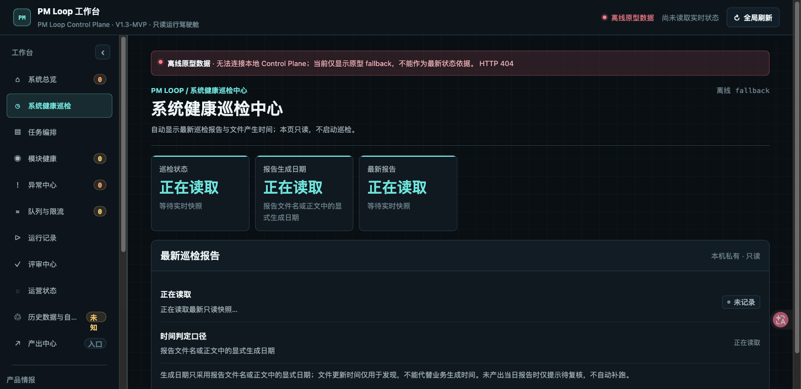 |
| 工作项：PM Loop 任务、状态、权限模式与下一步 | 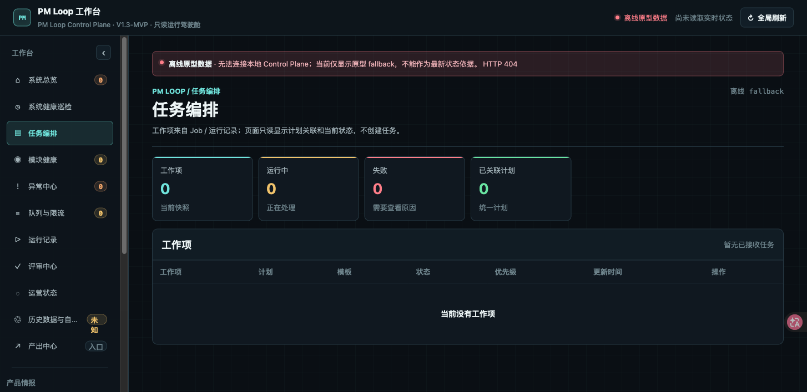 |
| 模块目录：Control Plane 暴露的功能模块 | 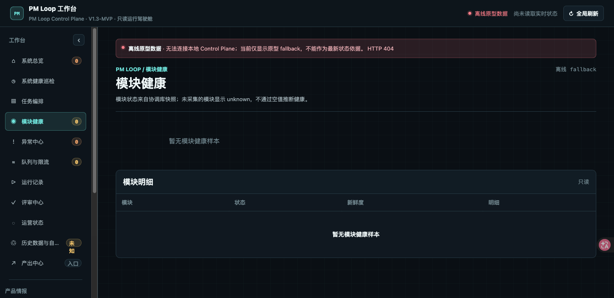 |
| 事件与故障：历史 incident、错误指纹与只读诊断 | 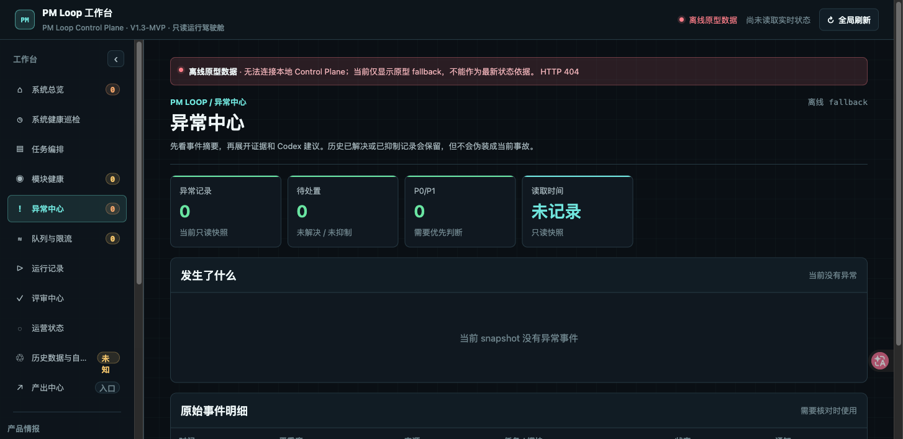 |
| OpenViking 队列：资源、revision、重试和错误分类 | 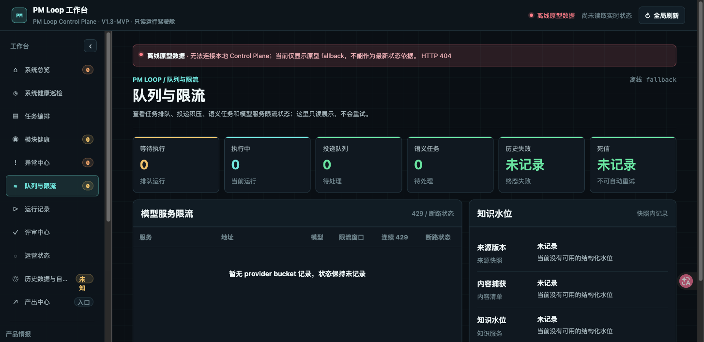 |
| 运行台账：Run 阶段、输入快照、事件和产物 | 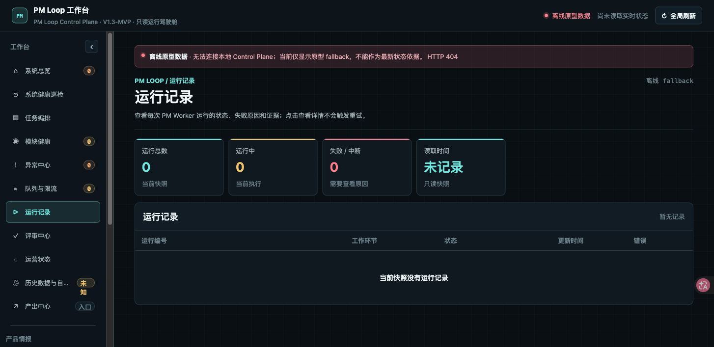 |
| 评审中心：Gate、人工决定、证据和受控负向测试 | 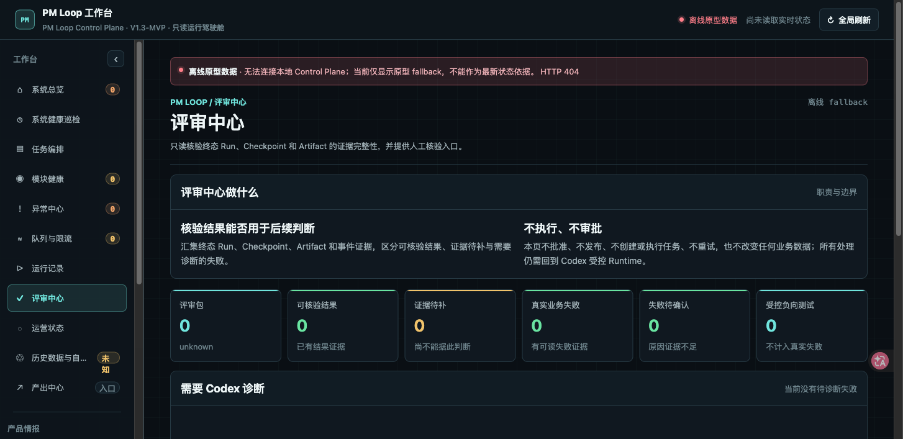 |
| 运营视图：调度、锁、依赖、运行与健康概览 | 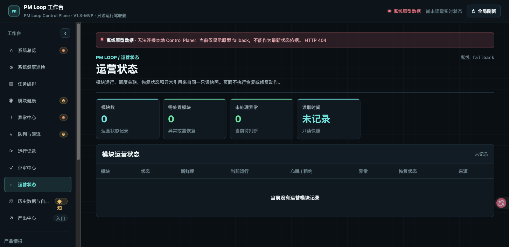 |
| Retention：数据源、策略、预计回收、隔离与证据 | 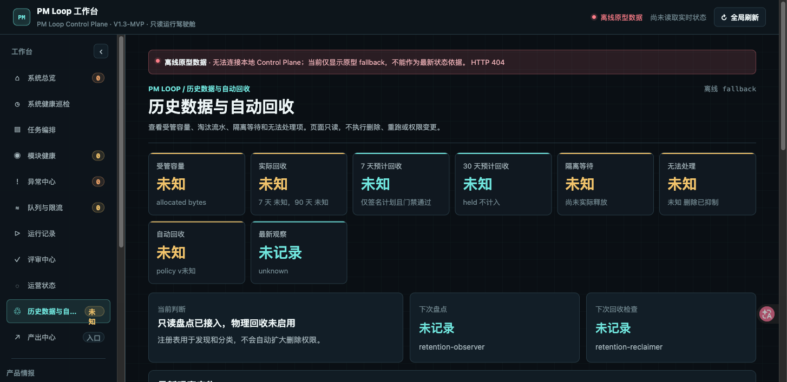 |
| 产物中心：历史报告、计划产物、筛选和受控打开 | 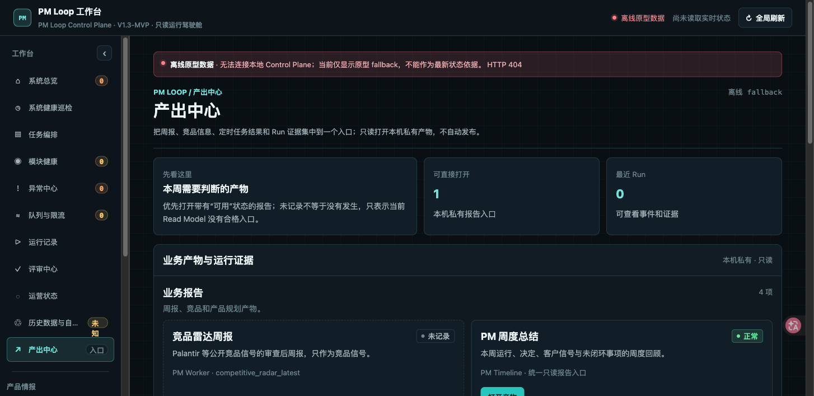 |
| Concept Learning Loop：概念 Active、Candidate、来源覆盖和 Gate | 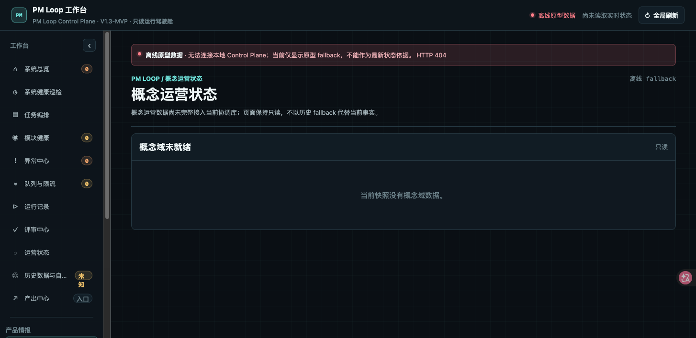 |
| 角色工作台：PM、交付、规划和运营的同源入口 | 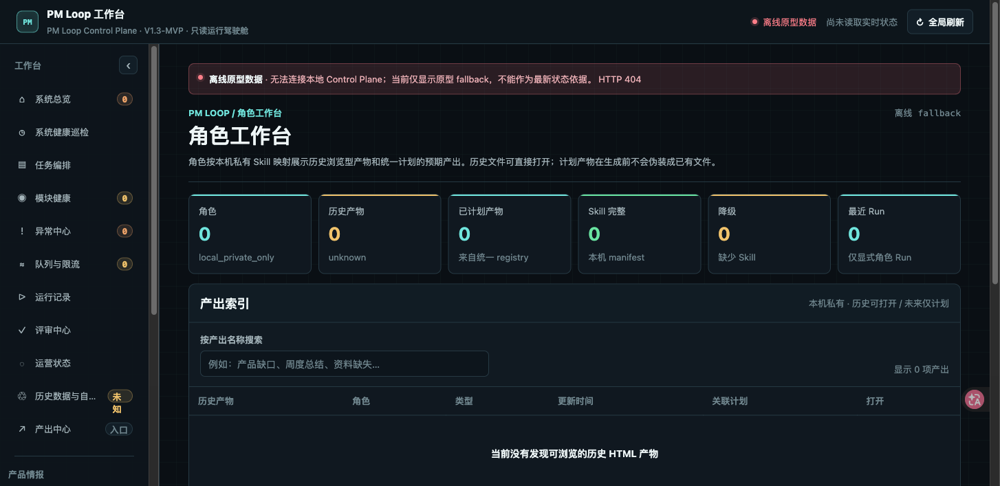 |
| 调度配置：日历任务、依赖触发、截止时间和下次运行 | 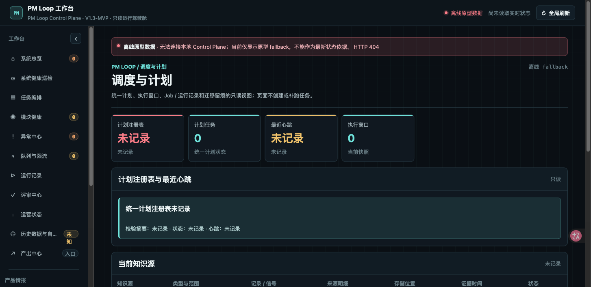 |
| 竞品雷达：公开来源、采集运行、证据覆盖和 reviewer 结论 | 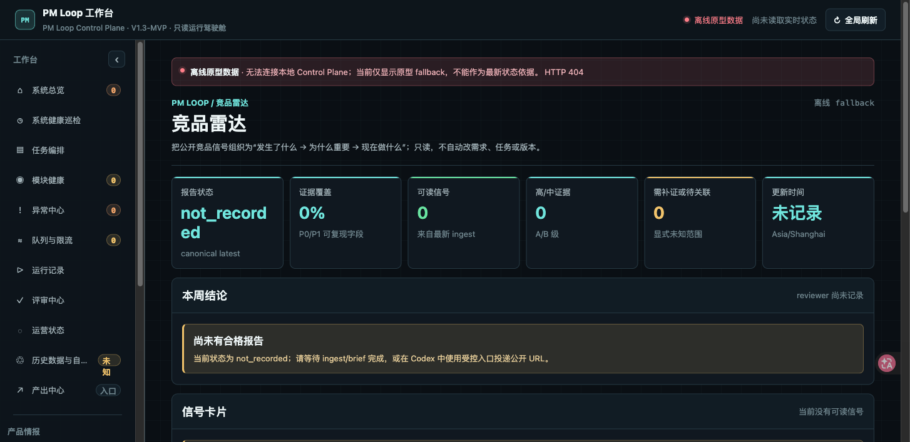 |


## 快速开始

### 克隆源码和 OpenViking 依赖

```bash
git clone --recurse-submodules https://github.com/jiezhu2007/pm-loop.git
cd pm-loop
git submodule update --init --recursive
```

如果已经克隆过主仓库，第二条命令会把 `vendor/openviking/source` 初始化到锁定提交。

### 安装与测试

```bash
python3 -m venv .venv
. .venv/bin/activate
python -m pip install -e '.[test]'
python scripts/verify_openviking_dependency.py
python -m pytest
```

也可以使用锁文件执行可复现安装：

```bash
uv sync --all-extras
uv run --all-extras pytest
```

部署机 LaunchAgent 核验需要显式设置 `PM_LOOP_VERIFY_INSTALLED_RUNTIME=1`；普通测试默认只使用临时目录。

### 启动本地工作台

```bash
PYTHONPATH=scripts python scripts/pm_loop_control_plane_server.py \
  --project-root "$PWD" \
  --state-dir "$HOME/.codex/pm-loop"
```

浏览器打开 <http://127.0.0.1:8765/>。生产运行所需的 Codex Runtime、OpenViking 服务、数据库、时间轴、客户资料和凭证都在仓库之外；仓库不会因为启动工作台而自动创建或提交这些数据。

### 创建一次只读/草稿运行

```bash
PYTHONPATH=scripts python scripts/pm_loop_runner.py create \
  --loop-id daily-radar \
  --permission-mode draft \
  --json

PYTHONPATH=scripts python scripts/pm_loop_runner.py list
```

完整执行前，应确认来源快照、权限模式和运行时 Gate 都符合本机部署策略。

## 目录结构

```text
pm-loop/
├── config/                         # 调度、Retention、OpenViking 依赖声明
├── scripts/                        # Runner、Scheduler、Worker、Read Model 和治理脚本
├── web/pm-loop-control-plane/      # 工作台静态页面与目标态 Demo
├── tests/                          # 单元、契约、恢复和黑盒边界测试
├── docs/assets/                    # README 使用的公开截图等静态资源
├── vendor/openviking/               # submodule 指针、补丁和第三方声明
├── LICENSE                         # PM Loop 自有代码的 Apache-2.0
└── pyproject.toml                  # Python 包和测试入口
```

仓库明确不包含：运行数据库、OpenViking 数据目录、客户资料、Ku 文档、PM Timeline 数据、日志、API key、`.venv`、LaunchAgent 实例配置和任何本机私有状态。

## 数据与权限边界

- 公开仓库只分发源码、测试、配置模板、静态页面、依赖声明和 OpenViking submodule 指针。
- Control Plane 的 HTTP GET 是只读读模型；V4 资源接口拒绝 POST、PUT、PATCH 和 DELETE。
- 外部消息、业务文档写入、概念发布、Retention 物理回收必须由 Codex Runtime 在显式授权下执行。
- OpenViking 地址、API key、SQLite 路径和状态根目录通过本机配置或环境变量提供，绝不写入 Git。
- 竞品雷达只处理登记的公开来源；浏览器兜底不用于绕过登录、人机验证或访问私有内容。

## 许可证

PM Loop 自有代码采用 [Apache License 2.0](LICENSE)。仓库内的 OpenViking 依赖仍按 [AGPL-3.0](vendor/openviking/THIRD_PARTY_NOTICES.md) 使用；PM Loop 分发的是固定 submodule 指针和针对该版本的差异补丁，不改变 OpenViking 的上游许可证和归因要求。

依赖基线、fork commit、补丁 SHA-256 和变更文件清单见 `config/openviking-dependency.json`。
